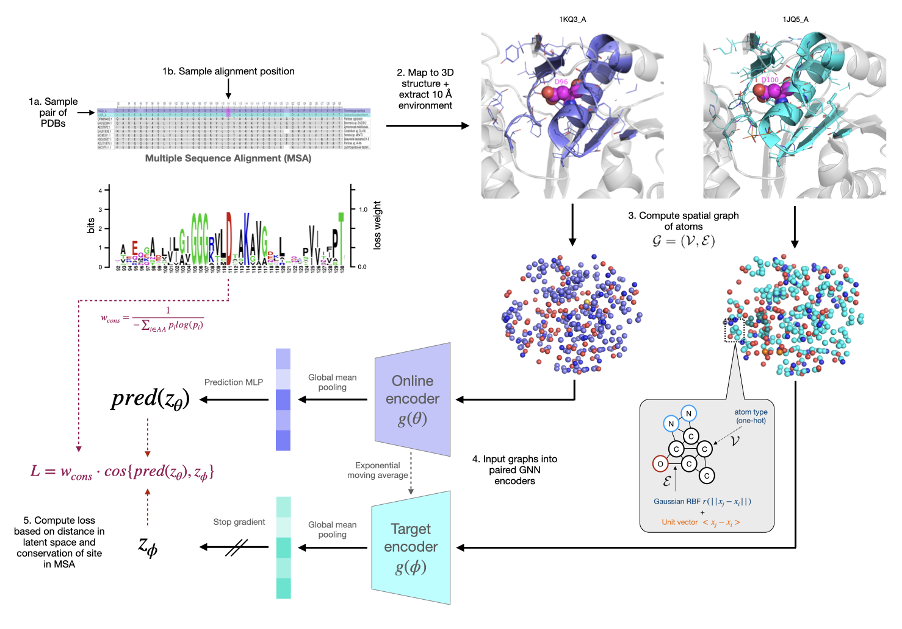

# COLLAPSE
COLLAPSE (COmpressed Latents Learned from Aligned Protein Structural Environments) is a representation learning method for protein structural and functional sites, as described in Derry et al. (2022). This repo contains all package functionality as well as scripts for functional site search and annotation, pre-training, and transfer learning on Prosite and ATOM3D datasets. For more details on COLLAPSE, please see our [preprint](https://www.biorxiv.org/content/10.1101/2022.07.20.500713v2).

The repo is organized as follows:

  - `./collapse`: package source code and core functionality
  - `./scripts`: Python scripts and notebooks used in our preprint.
  - `./data`: datasets, model checkpoints, etc.

<p align="center"></p>

## Requirements

We recommend installing COLLAPSE in a Conda environment (tested with GCC version 10.1.0). To create a Conda environment and download required packages on a machine with GPU, run the following script:

```
./install_dependencies.sh
```

For CPU-only functionality, you can run the following:

```
./install_dependencies_cpu.sh
```

Scripts may require additional dependencies, which may be installed using conda or pip as needed.


## Installation

Install the package using pip:

```
pip install .
```

## Downloading datasets

Datasets are hosted on [Zenodo](https://zenodo.org/record/6903423). The following datasets are available for download depending on your use case.

- `background_stats.tar.gz`: folder containing background distributions and statistics (needed for annotation and search applications)
- `checkpoints.tar.gz`: folder containing Pytorch checkpoints for model parameters (needed for all applications)
- `full_site_db_stats.pkl`: pickle file containing functional site embedding database with data from Prosite + CSA (needed for annotation application)
- `pdb_embeddings.pkl`: pickle file containing embeddings of all residues in 100% redundant subset of PDB chains (needed for search application)
- `pdb100_embeddings.tar.gz`: folder containing PDB100 embeddings, both pickle file above and LMDB format containing all embeddings, atom information, and metadata (very file, mostly useful for deriving new data subsets)

To download the dataset, download directly from Zenodo or use the following script, where FILENAME is the name of the file in Zenodo (e.g. `checkpoints.tar.gz`):

```
cd data
bash download_data.sh FILENAME
```

## Usage

Here we provide usage examples for several applications of COLLAPSE.

### Embed all residues in a PDB file

To embed all residues in a single structure using COLLAPSE, use the following lines of code. 
Here, `PDB_FILE` is the path to the PDB file containing the structure to be embedded, and `DEVICE` specifies where you want the embedding to run: `cpu` (default) or `cuda`
In this example, we only embed chain "A" and include all heteroatoms (ligands, ions, and cofactors).

```
from collapse import process_pdb, initialize_model, embed_protein

# Create model and load default parameters (pre-trained COLLAPSE model)
model = initialize_model(device=DEVICE)
# Load PDB file and pre-process to dataframe representation
atom_df = process_pdb(PDB_FILE, chain='A')
# Embed protein, returning dictionary of embeddings and metadata
emb_data = embed_protein(atom_df, model, include_hets=True, device=DEVICE)
```

The output of `embed_protein` is a dictionary containing the following data:
- `embeddings`: A numpy matrix (N x 512) containing embeddings of all N residues in protein.
- `resids`: List of length N containing residue IDs for each embedding, (e.g. A412, K23)
- `chains`: List of length N containing chain IDs for each embedding
- `confidence`: List of length N containing per-residue pLDDT scores (AlphaFold structures only)

### Embed entire dataset of PDB files

To embed all residues of all structures in a directory of PDB files, use the following script. 
`PDB_DIR` is the root directory of all the PDB files to be processed, possibly containing subdirectories. Accepted formats include `pdb`,  `pdb.gz`, and `cif`.
`OUT_DIR` is the location of the processed dataset.

```
python embed_pdb_dataset.py PDB_DIR OUT_DIR --filetype pdb
```

This script produces an embedding dataset in the LMDB format, allowing for compressed, fast, random access to all elements in the database, in which data is stored in a key-value format. Each element of the dataset produced by `embed_pdb_dataset.py` has the same keys as the outpute of `embed_protein` (see above), in addition to the following data from the initial PDB file:
  - `id`: The original PDB filename
  - `atoms`: The original PDB data, in [ATOM3D dataframe format](https://atom3d.readthedocs.io/en/latest/data_formats.html#the-atoms-dataframe)

To load this dataset in a Pytorch-style dataset format, you can use ATOM3D:

```
from atom3d.datasets import load_dataset
dataset = load_dataset(OUT_DIR, 'lmdb')
```

Additional arguments are:
- `--checkpoint` (default `./data/checkpoints/collapse_base.pt`): To specify a different checkpoint with pre-trained model parameters.
- `--split_id` (default 0): For processing dataset in chunks (useful for very large datasets), specify the split index. Must be less than `num_splits`.
- `--num_splits` (default 1): For processing dataset in chunks (useful for very large datasets), total number of splits.

If processing in chunks, each chunk of the processed dataset is stored in a `tmp_` directory. To combine these into a full processed dataset, you can use the following script from ATOM3D:

```
python -m atom3d.datasets.scripts.combine_lmdb OUT_DIR/tmp_* OUT_DIR/full
```

### Iterative search of functional site against PDB database

Given the structural site defined by a specific residue in a PDB file, you can search against a structure database using the following command.

```
python search_site.py PDB_FILE CHAIN RESID DATABASE
```

Additional arguments are:
- `--checkpoint` (default `./data/checkpoints/collapse_base.pt`): To specify a different checkpoint with pre-trained model parameters.
- `--outfile` (default `PDBID_CHAIN_RESID_search.csv`): CSV file to save output.
- `--cutoff` (default `1e-4`): Significance cutoff for keeping hits at each search iteration.
- `--num_iter` (default `3`): Number of search iterations.
- `--include_hets`: Flag indicating whether to include heteroatoms, such as ligands, ions, and cofactors, in the input PDB. Hydrogens and waters are always removed.
- `--verbose`: flag for whether or not to print progress during search.

Output file is a CSV with resulting PDBs, residue IDs, protein metadata, quantile-transformed cosine similarity, and the iteration and query where the result first appeared. The first row contains the query structure and residue ID.

Example:
```
python search_site.py data/examples/1a0h.pdb B H363 data/datasets/pdb100_embeddings/pdb_embeddings.pkl --cutoff 1e-3 --verbose --num_iter 3
```


### Annotate structure using functional site database


To annotate chains A and B in the structure stored in PDB_FILE, use the following command. The output will be a printed summary of the functional sites detected and the corresponding residues. You can also supply more than one PDB file to be annotated, each separated by a space. By default, the functional site database contains conserved residues from Prosite and the Catalytic Site Atlas (CSA).

```
python annotate_pdb.py PDB_FILE --chains AB
```

Additional arguments are:
- `--checkpoint` (default `./data/checkpoints/collapse_base.pt`): To specify a different checkpoint with pre-trained model parameters.
- `--db` (default `.data/full_site_db_stats.pkl`): Functional site embedding database to use, by default a combination of Prosite and CSA. Any database can be used as long as it is in the same pickled key-value format (see below).
- `--cutoff` (default 1e-4): Empirical p-value cutoff for selecting residues with significant similarity to a functional site. Reducing this will increase precision at the cost of potentially decreasing sensitivity.
- `--site_cutoff` (default 1e-4): Empirical p-value cutoff for selecting sites with significant similarity for mutual best-hits criterion. Reducing this will increase precision at the cost of potentially decreasing sensitivity.
- `--filetype` (default `pdb`): File type of input files (must all be the same filetype).
- `--include_hets`: Flag indicating whether to include heteroatoms, such as ligands, ions, and cofactors, in the input PDB. Hydrogens and waters are always removed.
- `--verbose`: Flag indicating whether to print all PDB and residue hits in results. By default, only the total number of PDBs is shown.


## License

This project is licensed under the [MIT license](LICENSE)

## References

If you use COLLAPSE, please cite our preprint:

> Derry, A., & Altman, R. B. (2022). COLLAPSE: A representation learning framework for identification and characterization of protein structural sites. bioRxiv.